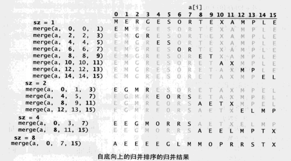

# 《算法》第二章学习笔记js实现

> 对排序算法，我们重点关注比较次数和两个元素交换的次数，对于不交换元素的算法，我们重点关注访问数组的次数

### 选择排序

思想:循环找到数组中最小的元素，和第一个元素交换，在剩下的元素中找到最小的元素，和第二个元素交换，一直比较下去

```
    /**
 * 
 * @param {array} arr 
 * @param {number} x 
 * @param {number} y 
 */
function exchange(arr, x, y) {
    var t = arr[x]
    arr[x] = arr[y]
    arr[y] = t
}

/**
 * 
 * @param {array} arr 
 */
function selectsort(arr) {

    var n = arr.length

    arr.forEach(function (x, i) {
        var min = i
        for (var j = i + 1; j < n; j++) {
            if (arr[min] > arr[j]) {
                min = j
            }
        }
        exchange(arr, i, min)
    })
}

```

- 复杂度分析

```
 对于长度为N的数组
/**
 * i  内循环 比较次数
 * 0   N-1
 * 1   N-2
 * .
 * .
 * .
 * N-2 1
 * N-1 无
**/
```
所以排序N个元素,总的比较次数为: （N-1)(1+N-1)/2 = (N-1)N/2  ~N^2/2 (等差数列) 

每次循环都会交换1次，总的交换次数就是N

所以时间复杂度是`平方级`

选择排序的特点:

- [x] 运行时间与输入无关

- [x] 数据移动是最少的

### 插入排序

思想：将要排序的元素插入到有序序列的适当位置，和选择排序一样，当前索引左侧的元素都是有序的，但他们的最终位置还不确定，可能会被移动

```
/**
 * 
 * @param {array} arr 
 * @param {number} x 
 * @param {number} y 
 */
function exchange(arr, x, y) {
    var t = arr[x]
    arr[x] = arr[y]
    arr[y] = t
}

/**
 * 判断两个值的大小
 * @param {*} x 
 * @param {*} y 
 */
function less(x, y) {
    return x < y
}

/**
 * @param {array} arr 
 */
function insertsort(arr) {

    var n =arr.length

    arr.forEach((x, i) => {

        for (var j = i + 1; j < n && j > 0 && less(arr[j], arr[j - 1]); j--) {
            exchange(arr, j, j - 1)
        }

    })

    return arr
}

```

复杂度分析:

插入排序的效率和输入有关

在最好的情况下，元素都是有序的，则比较次数为N-1，交换次数为0

在最坏的情况下,元素都是逆序有序的

```
/**
 * 5 4 3 2 1
 * 4 5 3 2 1   第1次
 * 3 4 5 2 1   第2次
 * 
 * 外循环i   内循环j   比较   交换  
 * 0         1        1     1  
 * 1         2        2     2  
 * 2         3        3     3  
 * .
 * .
 * .
 * N-2       N-1      N-1   N-1
 * N-1       无   
 */
```

对于N个值的排序,总的比较次数 (1+N-1)(N-1)/2 = N(N-1)/2 ~ N^2/2 (等差数列) 

交换 和 比较一样

所以平均情况下 插入排序的时间复杂度也是`平方级`

### 归并排序

> 要将一个数组排序，要先（递归的）将它分成两半分别排序，再将结果归并起来，归并排序能够保证将任意长度为N的数组排序所需的时间和`NlogN`成正比,主要缺点是所需的额外空间和`N`成正比

- 自顶向下的归并排序

> 自顶向下的归并排序是应用`分治思想`的典型例子


```
function MergeSort(arr) {
    this.source = arr
    this.tempArr = new Array(arr.length).fill(0)
    this.init()
}

MergeSort.prototype.init = function () {
    var len = this.source.length
    this.sort(this.source, 0, len-1)
}

/**
 * 判断两个值的大小
 * @param {number} j 
 * @param {number} i 
 */
MergeSort.prototype.less = function (j, i) {
    return this.tempArr[j] < this.tempArr[i]
}

/**
 * 将两个有序数组合并成一个
 * @param {array} arr 
 * @param {number} start 
 * @param {number} min 
 * @param {number} end 
 */
MergeSort.prototype.merge = function (arr, start, min, end) {
    var i = start
    var j = min + 1
    for (var k = 0; k <= end; k++) {
        this.tempArr[k] = arr[k]
        this.tempArr.push(arr[k])
    }
    for (var k = start; k <= end; k++) {
        if (i > min) {
            arr[k] = this.tempArr[j++]
        } else if (j > end) {
            arr[k] = this.tempArr[i++]
        } else if (this.less(j, i)) {
            arr[k] = this.tempArr[j++]
        } else {
            arr[k] = this.tempArr[i++]
        }
    }
}
/**
 * 自顶向下的归并排序
 */
MergeSort.prototype.sort = function (arr, start, end) {
    if (start >= end) return
    var min = start + Math.floor((end - start) / 2)
    this.sort(arr, start, min)
    this.sort(arr, min + 1, end)
    this.merge(arr, start, min, end)
}

```

复杂度分析:


如图所示,树中的每个节点都表示一个sort()方法通过merge()归并而成立的子数组，这棵树正好有`n层`。

对于0 ~ n-1之间的任意k，自顶向下的第k层有`2^k`个子数组,每个数组的长度为2^n / 2^k = `2^(n-k)`，归并最多需要2^(n-k)次比较。

因此每层的比较次数为 2^k*2^n = 2^n次,n层共为`n*2^n`次

对位长度为N的数组,n为lgN(以2位底的对数表示为lg),所以 n*2^n = lgN*2^n = `NlgN`

- 自底向上的归并排序

> 实现归并排序的的另一种方法是先归并那些微型数组，然后再成对归并得到的子数组，直到将整个数组归并起来

```
less = function (j, i) {
    return tempArr[j] < tempArr[i]
}

function merge(arr, start, min, end) {
    var i = start
    var j = min + 1
    for (var k = 0; k <= end; k++) {
        tempArr[k] = arr[k]
        tempArr.push(arr[k])
    }
    for (var k = start; k <= end; k++) {
        if (i > min) {
            arr[k] = tempArr[j++]
        } else if (j > end) {
            arr[k] = tempArr[i++]
        } else if (less(j, i)) {
            arr[k] = tempArr[j++]
        } else {
            arr[k] = tempArr[i++]
        }
    }
}

//两两归并小数组
function sort(arr) {
    var n = arr.length
    for (var sz = 1; sz < n; sz += sz) {
        for (var i = 0; i < n - sz; i += sz + sz) {
            merge(arr, i, i + sz - 1, Math.min(i + sz + sz - 1, n - 1))
        }
    }

}
```




### 快速排序


> 快速排序是一种分治的排序算法，它将一个数组分成两个子数组，独立排序。快速排序和归并排序是互补的；在归并排序中，一个数组被等分成两半，在快速排序中，切分的位置取决于数组的内容。

> 快速排序的特点保存它是原地排序，且将长度为N的数组排序所需的时间和`NlgN`成正比

```

function quicksort(arr,start,end){

    if(start>=end) return 

    var j=partition(a,start,end) //确定切分点

    sort(arr,start,j)

    sort(arr,j+1,end)

}

```

该方法的关键在于切分，切分使得数组满足下面三个条件

- [x] 对于某个j,a[j]已经排好

- [x] a[start]到a[j-1]的所有元素都不大于a[j]

- [x] a[j+1]到a[end]的所有元素都不小于a[j]


切分的思想是: 先随意的取a[start]作为切分元素，然后从数组的左侧开始遍历，找到第一个不小于a[start]的元素，从数组的右侧开始遍历，找到第一个不大于a[start]的元素，将两个元素交换，继续左右两侧的遍历、交换，直到左右遍历相交，然后将相交位置的元素与a[start]交换


```
function less(x, y) {
    return x >= y
}

function exchange(arr, i, j) {
    var t = arr[i]
    arr[i] = arr[j]
    arr[j] = t
}

//切分算法
function partition(arr, start, end) {

    var i = start
    var j = end + 1
    var v = arr[start]
    while (true) {

        while (less(v, arr[++i])) {
            if (i == end) {
                break;
            }
        }
        while (less(arr[--j], v)) {
            if (j == start) {
                break
            }
        }
        if (i >= j) break
        exchange(arr, i, j)
    }
    exchange(arr, start, j)
    return j
}

```